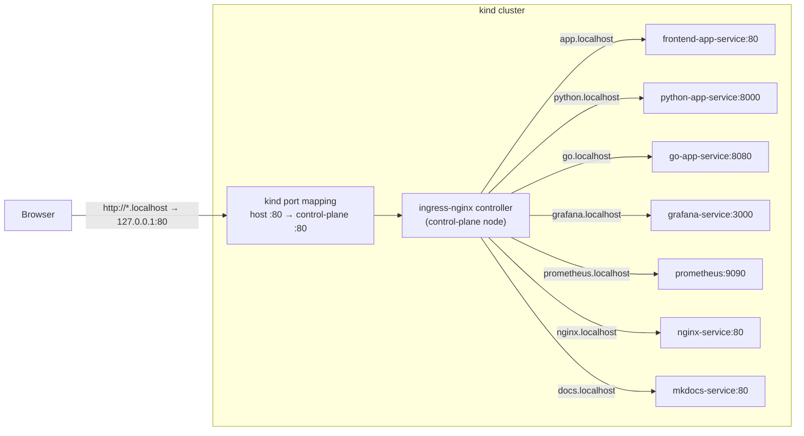
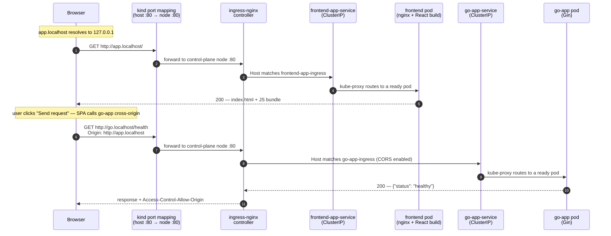

# Architecture Design

## Purpose

A local Kubernetes playground (`kind`, 3 nodes: 1 control-plane, 2 workers) for practicing DevOps workflows: deploying services, exposing metrics, building Grafana dashboards, and observing traffic end-to-end.

## Components

| Component | Role | Ingress host |
|---|---|---|
| `python-app` | FastAPI sample backend, exposes `/metrics` | http://python.localhost |
| `go-app` | Gin sample backend, exposes `/metrics` | http://go.localhost |
| `nginx` | Standalone sample app, scraped via `nginx-exporter` | http://nginx.localhost |
| `frontend-app` | React UI to trigger requests against python-app/go-app | http://app.localhost |
| `prometheus` | Scrapes metrics from all app `/metrics` endpoints + node exporters | http://prometheus.localhost |
| `grafana` | Dashboards over Prometheus data, provisioned via Ansible | http://grafana.localhost |
| `documentation` | MkDocs site (this doc) | http://docs.localhost |

## Network Configuration

All host traffic enters through a single entry point: the ingress-nginx controller, published on host port 80. The chain is:

1. `*.localhost` hostnames resolve to loopback (built into browsers, macOS, and systemd-resolved on Linux/CI — no DNS or `/etc/hosts` setup).
2. `kind-cluster.yaml` maps host port 80 to port 80 on the control-plane node, where the ingress-nginx controller runs (`ingress-ready=true` node label).
3. The controller matches the request's `Host` header against the `Ingress` resources (one per component, in each component's `k8s/` directory) and forwards to that component's `ClusterIP` Service.
4. kube-proxy load-balances the Service to a ready pod, which may run on any worker node.

### Routing map

### Life of a sample request

A user opens the frontend and triggers a health check against go-app. Two requests cross the cluster boundary: loading the SPA, then the cross-origin API call the SPA makes from the browser.

- The React UI calls the backends cross-origin on their own ingress hosts; the python-app and go-app Ingresses enable CORS (`nginx.ingress.kubernetes.io/enable-cors`).
- Monitoring traffic never leaves the cluster: Prometheus scrapes each app's `/metrics` and Grafana queries Prometheus via in-cluster service DNS.
- The standalone `nginx` component is a sample app monitored via `nginx-exporter` on port 9113.

## Sample Backends (python-app, go-app)

Both expose the same endpoint contract so the frontend can target either interchangeably:
- `GET /` — home
- `GET /health` — health check (also used by each pod's Kubernetes `readinessProbe`)
- `GET /error` — simulated 500
- `GET /redirect` — redirect to `/health`
- `GET /metrics` — Prometheus format

## Monitoring

Prometheus scrapes every component's `/metrics` endpoint and Grafana visualizes
the data, with datasource and dashboards provisioned as code via Ansible. See
the [Monitoring](monitoring.md) page for scrape jobs, exposed metrics, and the
dashboard workflow.

## Deployment

- Entry point: `./recreate-cluster.sh` — idempotent, deletes/recreates the `kind` cluster, installs ingress-nginx (pinned Kind manifest), builds and loads all Docker images, applies each component's `k8s/` manifests in order (Prometheus → Grafana → NGINX → python-app → go-app → frontend-app → documentation), then provisions Grafana dashboards via Ansible.
- Each component directory is self-contained: its own `Dockerfile`, `k8s/` manifests (Deployment, Service, Ingress), and `README.md`.
- `kind-cluster.yaml` maps only host port 80 to the control-plane node, where the ingress controller runs (`ingress-ready=true` label).

## Testing

- Unit tests: `make test-unit` — per-service Go (`go test`) and Python (`tox`) suites, auto-discovered (see `adding-a-service.md`).
- End-to-end tests: `make test-e2e` — black-box pytest suite in `e2e/` that exercises the running cluster through the ingress hosts: backend endpoint contract, frontend serving and CORS, and the traffic → Prometheus → Grafana pipeline. Requires the cluster to be up (`./recreate-cluster.sh`); CI runs the full flow in `.github/workflows/e2e.yaml` (see `e2e-tests.md`).

## Conventions

- All K8s manifests applied idempotently (`kubectl apply`).
- New Go services are auto-discovered by presence of `go.mod`; new Python services by presence of `tox.ini` (see `adding-a-service.md`).
